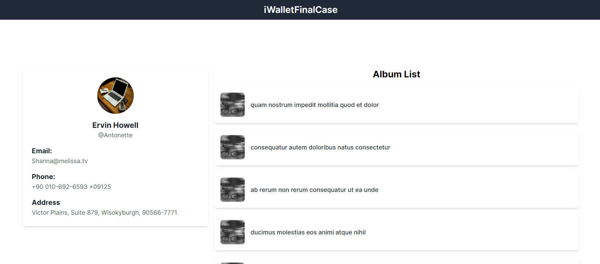
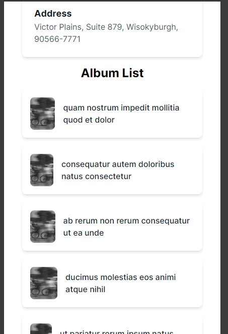

# iWalletFinalCase

Merhaba,
Öncelikle ben "https://jsonplaceholder.typicode.com/users" API'a POST isteği atılmadığı için json-server ile projeme başladım. Testlerimi bu şekilde yürüttüm. Öncelikle json-server kurulumu bu anlatayım.

- `npm install -g json-server` komutu ile kurulumu yapıyoruz
- db.json adında bir dosya oluşturuyoruz.
- Dummy data ekliyoruz.
- `json-server --watch db.json --port 3001` komutu ile 3001 portunda serverı ayağa kaldırıyoruz.
- Artık Rails uygulamamızda localhost:3001 adresine istek atabiliriz.

HTTP isteklerini yapmak için faraday gem'ini kullandım.

Search ve popup modülleri için Turbo Stimulus kullandım.

Rails projemizi ayağa kaldırmak için;

- bin/dev

Projemde sidekiq background job'ını kullandım. API'da yapılan bir post, update işleminde bu job çalışıp veritabanımızda yeni bir veri ekliyor veya bir veriyi güncelleme işlemini yapıyor. Bu şekilde hem API tarafındaki verilerimiz hemde database tarafındaki verilerimiz güncel ve eşitlenmiş oluyor.

## Anasayfa

## User Create

## User Show

## User Edit

## Search

## Popup

